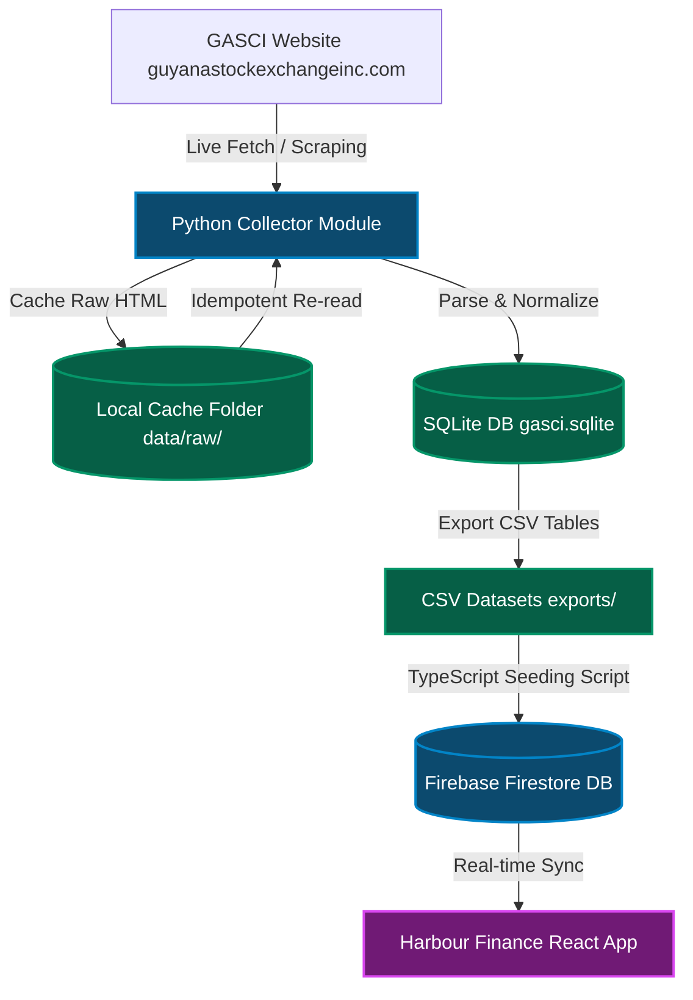

# Harbour Finance & Caribbean Equity Ledger

A unified ecosystem for tracking, analyzing, and auditing stock portfolios across Caribbean stock exchanges, specifically featuring a complete historical data pipeline for the **Guyana Stock Exchange (GASCI)**.

This repository consists of two core components:
1. **Harbour Finance (Frontend Web App):** A React + TypeScript web application that provides portfolio tracking, holding ledger, performance trends (Value vs. Return % charts), multi-currency conversions, and Google Authentication synced to Firebase Firestore.
2. **GASCI Stock Exchange Offline Collector (Data Pipeline):** A Python offline scraping, parsing, validation, and export pipeline that extracts 23 years of historical trading data from the Guyana Stock Exchange, handles name normalizations, parses stale prices, and exports clean CSV tables.

---

## System Architecture



---

## 1. Harbour Finance (Web Application)

Harbour Finance is a responsive web application that tracks portfolios in real-time, converts various regional currencies (GYD, JMD, TTD, BBD, USD) dynamically, and calculates performance metrics.

### Technical Stack
* **Framework:** React 19 + TypeScript + Vite
* **Styling:** Vanilla CSS + TailwindCSS (v4)
* **State Management:** React Context API + Firestore real-time listeners (`onSnapshot`)
* **Database & Auth:** Firebase Firestore, Firebase Authentication (Google OAuth)
* **Visualization:** Recharts (responsive performance charts with Value/Return select toggles)

### Execution Instructions

#### Setup Prerequisites:
Install Node.js (v18+) and dependencies:
```bash
npm install
```

#### Run Local Workstation (Firestore Emulator Mode):
To run the app isolated from production, pointing to the local Firestore and Auth emulators:
1. Start the Firebase emulators:
   ```bash
   npm run emulators
   ```
2. Start the Vite development server in workstation mode (loads `.env.workstation`):
   ```bash
   npm run dev:local
   ```
3. Open the app in your browser at `http://localhost:3000`.

#### Run Development (Cloud Dev Firestore Mode):
To run the app locally but synced with the live cloud dev database (`harbour-finance-902b`):
```bash
npm run dev:cloud
```

#### Build for Production:
Compile and bundle the frontend for deployment:
```bash
npm run build
```

---

## 2. GASCI Stock Exchange Offline Collector (Python Pipeline)

The collector tool acts as an offline pipeline. It discovers weekly trade archives from the exchange, downloads and caches raw HTML files, normalizes security tickers, and resolves carried-forward stale price records.

### Technical Stack
* **Language:** Python 3.9+
* **HTML Parsing:** BeautifulSoup4
* **Database:** SQLite
* **HTTP Library:** Requests
* **Testing:** Pytest

### Key Pipeline Features
* **Sucuri Firewall Bypassing:** Configured with realistic HTTP user-agent headers and polite request pacing.
* **Polite Crawling (`--live-fetch-limit`):** To avoid triggering firewall blocks, the build/update command supports limiting the number of live HTTP requests made in a single execution.
* **Disk Caching:** All fetched URLs are saved in `data/raw/`. Rerunning commands instantly skips cached files, making the scraper highly idempotent.
* **Stale Prices Resolution:** If a stock did not trade during a weekly session, the exchange carries forward its last traded price. The tool inspects the trade date and records the price under its *actual transaction date* with a lower confidence rating, preventing portfolio visualizations from showing flatlines.

### Execution Instructions

1. Navigate to the collector subdirectory:
   ```bash
   cd equity-ledger
   ```
2. Install Python dependencies:
   ```bash
   python3 -m pip install requests beautifulsoup4 pytest
   ```
3. Run the Collector CLI:
   * **Build the database from scratch (caching pages & parsing):**
     ```bash
     python3 -m gasci_collector build
     ```
     *Support Flags:*
     * `--live-fetch-limit <N>`: Stop the crawl after making $N$ live network requests (uses cached files for the rest).
     * `--start-date YYYY-MM-DD` / `--end-date YYYY-MM-DD`: Crawl and parse sessions only within a specific range.
   * **Incrementally update database with new sessions:**
     ```bash
     python3 -m gasci_collector update
     ```
   * **Run data quality check suite:**
     ```bash
     python3 -m gasci_collector validate
     ```
   * **Export database tables to CSV:**
     ```bash
     python3 -m gasci_collector export
     ```

---

## 3. Database Seeding & Data Backfill

To upload raw CSV data to Firestore, a node typescript utility is executed.

1. Relax Firestore write rules in `firestore.rules`.
2. Execute the seeding script (e.g., `npx tsx scratch/import_range_prices.ts`):
   * **Seeding Local Emulator:**
     ```bash
     npx tsx scratch/import_range_prices.ts --local
     ```
   * **Seeding Cloud Dev:**
     ```bash
     npx tsx scratch/import_range_prices.ts --cloud
     ```
3. Restore secure write rules to `firestore.rules` and redeploy.