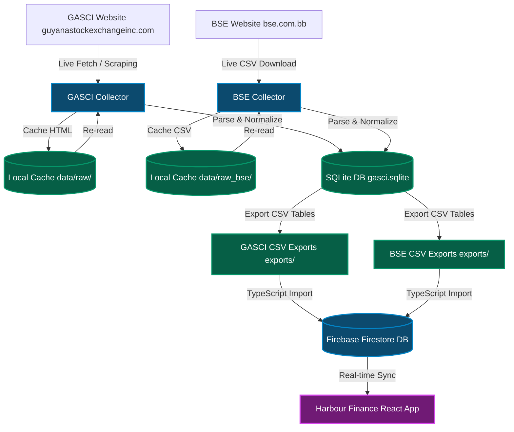

# Harbour Finance & Caribbean Equity Ledger

A unified ecosystem for tracking, analyzing, and auditing stock portfolios across Caribbean stock exchanges, specifically featuring complete historical data pipelines for the **Guyana Stock Exchange (GASCI)** and the **Barbados Stock Exchange (BSE)**.

This repository consists of two core components:
1. **Harbour Finance (Frontend Web App):** A React + TypeScript web application that provides portfolio tracking, holding ledger, performance trends (Value vs. Return % charts), multi-currency conversions, and Google Authentication synced to Firebase Firestore.
2. **Offline Data Collectors (Data Pipelines):**
   * **GASCI Stock Exchange Offline Collector:** A Python offline scraping, parsing, validation, and export pipeline that extracts historical trading data from the Guyana Stock Exchange, handles name normalizations, parses stale prices, and exports clean CSV tables.
   * **BSE Barbados Stock Exchange Offline Collector:** A Python offline fetching, parsing, and export pipeline that downloads daily CSV reports from the Barbados Stock Exchange, parses sections (Main, Fixed Income, ISM), normalizes regional listings, and exports CSV tables. Both collectors feed a single unified SQLite database.

---

## System Architecture



---

## 1. Harbour Finance (Web Application)

Harbour Finance is a responsive web application that tracks portfolios in real-time, converts various regional currencies (GYD, JMD, TTD, BBD, USD) dynamically, and calculates performance metrics.

### Technical Stack
* **Framework:** React 19 + TypeScript + Vite
* **Styling:** Vanilla CSS + TailwindCSS (v4)
* **State Management:** React Context API + Firestore real-time listeners (`onSnapshot`)
* **Database & Auth:** Firebase Firestore, Firebase Authentication (Google OAuth)
* **Visualization:** Recharts (responsive performance charts with Value/Return select toggles)

### Execution Instructions

#### Setup Prerequisites:
Install Node.js (v18+) and dependencies:
```bash
npm install
```

#### Run Local Workstation (Firestore Emulator Mode):
To run the app isolated from production, pointing to the local Firestore and Auth emulators:
1. Start the Firebase emulators:
   ```bash
   npm run emulators
   ```
2. Start the Vite development server in workstation mode (loads `.env.workstation`):
   ```bash
   npm run dev:local
   ```
3. Open the app in your browser at `http://localhost:3000`.

#### Run Development (Cloud Dev Firestore Mode):
To run the app locally but synced with the live cloud dev database (`harbour-finance-902b`):
```bash
npm run dev:cloud
```

#### Build for Production:
Compile and bundle the frontend for deployment:
```bash
npm run build
```

---

## 2. Offline Data Collectors (Python Pipelines)

The collector tools act as offline pipelines to crawl historical sessions, cache fetched content on disk, parse raw formats, and upsert records into a unified SQLite database (`data/gasci.sqlite`).

### Technical Stack
* **Language:** Python 3.9+
* **Libraries:** Requests, BeautifulSoup4
* **Database:** SQLite
* **Testing:** Pytest

### Setup Instructions
1. Navigate to the collector subdirectory:
   ```bash
   cd equity-ledger
   ```
2. Install Python dependencies:
   ```bash
   python3 -m pip install requests beautifulsoup4 pytest
   ```

### Running the Collectors

#### GASCI Guyana Stock Exchange Collector
Run the tool using the module syntax:
```bash
python3 -m gasci_collector build [options]
python3 -m gasci_collector update [options]
python3 -m gasci_collector validate
python3 -m gasci_collector export
```
* **`build`**: Crawl historical weekly session pages.
* **`update`**: Incrementally check index page for new sessions.
* **`validate`**: Run data quality validations (future dates, negative values, stale alerts).
* **`export`**: Export CSV files to `exports/` (`securities.csv`, `sessions.csv`, `prices.csv`, `gasci_historical_prices.csv`).

#### BSE Barbados Stock Exchange Collector
Run the tool using the module syntax:
```bash
python3 -m bse_collector.cli build [options]
python3 -m bse_collector.cli update [options]
python3 -m bse_collector.cli export
python3 -m bse_collector.cli list-securities
python3 -m bse_collector.cli list-sessions
```
* **`build`**: Crawl weekdays in a range and fetch daily CSV files from BSE.
  * *Flags:* `--start-date YYYY-MM-DD` and `--end-date YYYY-MM-DD` to restrict range (defaults to a 14-day lookback).
* **`update`**: Find the maximum session date in the DB and incrementally crawl/fetch up to today.
* **`export`**: Export CSV files to `exports/` (`bse_securities.csv`, `bse_sessions.csv`, `bse_prices.csv`, `bse_historical_prices.csv`).

---

## 3. Database Seeding & Data Backfill

To upload raw CSV data to Firestore, a Node TypeScript utility is executed.

1. Relax Firestore write rules in `firestore.rules`.
2. Execute the seeding script (e.g., `npx tsx scratch/import_range_prices.ts`):
   * **Seeding Local Emulator:**
     ```bash
     npx tsx scratch/import_range_prices.ts --local
     ```
   * **Seeding Cloud Dev:**
     ```bash
     npx tsx scratch/import_range_prices.ts --cloud
     ```
3. Restore secure write rules to `firestore.rules` and redeploy.